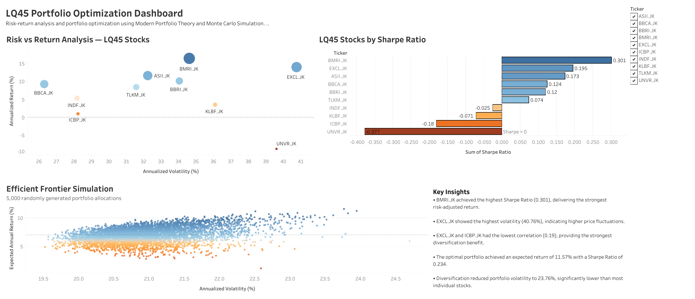

# 📈 LQ45 Portfolio Analysis & Optimization

> **Optimizing equity portfolio allocation using Monte Carlo simulation, Modern Portfolio Theory, and risk-return analytics on LQ45 stocks.**

---

## 🗂️ Table of Contents

- [Overview](#overview)
- [Dataset](#dataset)
- [Business Questions](#business-questions)
- [Methodology](#methodology)
- [Dashboard Preview](#dashboard-preview)
- [Key Findings](#key-findings)
- [Project Structure](#project-structure)
- [How to Run](#how-to-run)
- [Tools](#tools)
- [Author](#author)

---

## Overview

This project performs a comprehensive risk-return analysis on 10 actively traded Indonesian stocks from the **LQ45 index**, covering the period **January 2020 – December 2025**. Using Modern Portfolio Theory (MPT) and Monte Carlo simulation, the analysis identifies the optimal portfolio allocation that maximizes the Sharpe Ratio — offering the best risk-adjusted return for investors.

The project demonstrates end-to-end data analysis skills: from data ingestion and cleaning, through statistical modeling, to interactive dashboard storytelling.

---

## Dataset

| Property | Detail |
|---|---|
| **Source** | Yahoo Finance via `yfinance` Python library |
| **Stocks** | BBCA, BBRI, TLKM, ASII, BMRI, UNVR, ICBP, KLBF, EXCL, INDF |
| **Index** | LQ45 (Indonesia Stock Exchange) |
| **Period** | January 2020 – December 2025 (6 years) |
| **Frequency** | Daily closing prices |
| **Records** | ~1,200 trading days × 10 stocks |

---

## Business Questions

Individual investors in Indonesia often build portfolios based on intuition rather than data. Key questions this project answers:

- Which LQ45 stocks offer the best risk-adjusted returns?
- How correlated are these stocks — and which combinations reduce overall portfolio risk?
- What is the **optimal allocation** across these stocks to maximize the Sharpe Ratio?
- How does portfolio performance vary across 5,000 simulated allocation scenarios?

---

## Methodology

### 1. Data Collection & Cleaning
- Retrieved adjusted closing prices using `yfinance`
- Handled missing values with forward-fill (carry last known price)
- Validated data completeness across all tickers

### 2. Exploratory Data Analysis (EDA)
- Computed **daily returns** for all 10 stocks
- Calculated **rolling 30-day volatility** to observe risk over time
- Built a **correlation heatmap** to identify diversification opportunities
- Normalized price chart (base = 100) to compare relative performance

### 3. Risk-Return Analysis
- **Annualized Return**: Mean daily return × 252 trading days
- **Annualized Volatility**: Standard deviation of daily returns × √252
- **Sharpe Ratio**: `(Annual Return − Risk-Free Rate) / Volatility`
  - Risk-free rate assumption: **6%** (Bank Indonesia benchmark rate reference)

### 4. Monte Carlo Portfolio Simulation
- Generated **5,000 random portfolio weight combinations**
- Each combination satisfies: all weights ≥ 0, sum of weights = 100%
- Computed portfolio return, volatility, and Sharpe Ratio for each
- Plotted the **Efficient Frontier** to visualize the risk-return trade-off
- Identified the **maximum Sharpe Ratio portfolio** as the optimal allocation

### 5. Dashboard & Storytelling
- Exported all results to CSV files for Tableau visualization
- Built a 4-page interactive dashboard covering:
  - Stock performance overview
  - Individual risk-return comparison
  - Efficient frontier scatter plot
  - Optimal portfolio allocation recommendation

---

## Dashboard Preview



🔗 [View on Tableau Public](https://public.tableau.com/app/profile/fatwa.nurhidayat/viz/LQ45PortfolioOptimizationDashboard/Dashboard) 

---

## Key Findings

> *Note: Values below are illustrative examples based on historical data. Actual results may vary.*

- **Best Sharpe Ratio stock**: BMRI.JK — delivered the strongest risk-adjusted return among all selected LQ45 stocks, with a Sharpe Ratio of 0.301
- **Highest volatility**: EXCL.JK — recorded the highest price fluctuation (40.76%), indicating a relatively aggressive risk profile
- **Lowest correlation pair**: EXCL.JK & ICBP.JK — showed the weakest correlation (0.19), suggesting strong diversification potential when combined in a portfolio
- **Optimal portfolio** (max Sharpe Ratio ≈ 0.234):
    - ASII.JK: ~29%
    - BMRI.JK: ~24%
    - BBRI.JK: ~13%
    - BBCA.JK: ~9%
    - TLKM.JK: ~9%
    - Others: distributed across the remaining assets
- **Efficient Frontier** reveals:
    - higher expected returns generally require higher portfolio risk,
    - while diversification across multiple LQ45 sectors helps reduce overall portfolio volatility and improve portfolio efficiency
 
---


## Project Structure

```
Indonesian-Stock-Analysis/
│
├── data/
│   ├── stock_price.csv             # Raw daily closing prices
│   ├── daily_returns.csv           # Computed daily returns
│   ├── stock_summary.csv           # Annualized return, volatility, Sharpe per stock
│   └── monte_carlo.csv             # 5,000 simulated portfolio metrics
│
├── notebooks/
│   └── ind_stock_analysis.ipynb    # Main analysis notebook (fully documented)
│
├── output/
│   ├── correlation_heatmap.png     # Correlation heatmap
│   ├── normalized_price.png        # Normalized price chart
│   └── efficient_frontier.png      # Monte Carlo efficient frontier plot
│
└── README.md
```

---

## How to Run

### Prerequisites
- Python 3.9+
- Jupyter Notebook or JupyterLab

### Installation

```bash
# Clone the repository
git clone https://github.com/fatwanurhdyt/Indonesian-Stock-Analysis.git
cd Indonesia-Stock-Analysis

# Install dependencies
pip install yfinance pandas numpy matplotlib seaborn scipy jupyter
```

### Run the Notebook

```bash
jupyter notebook notebooks/ind_stock_analysis.ipynb
```

The notebook will automatically fetch the latest stock data from Yahoo Finance. To replicate the exact results in this README, set the date range to `2020-01-01` to `2025-12-31`.

---

## Tools & Libraries

| Category | Tools |
|---|---|
| **Language** | Python 3.11 |
| **Data Retrieval** | `yfinance` |
| **Data Manipulation** | `pandas`, `numpy` |
| **Visualization (Python)** | `matplotlib`, `seaborn` |
| **Dashboard** | Tableau Public |
| **Environment** | Jupyter Notebook |

---

## Author

**Fatwa Nurhidayat**
- GitHub: [@fatwanurhdyt](https://github.com/fatwanurhdyt)
- LinkedIn: [linkedin.com/in/fatwanurhdyt](https://linkedin.com/in/fatwanurhdyt)
- Email: [fatwa.nrhdyt@gmail.com](mailto:fatwa.nrhdyt@gmail.com)
